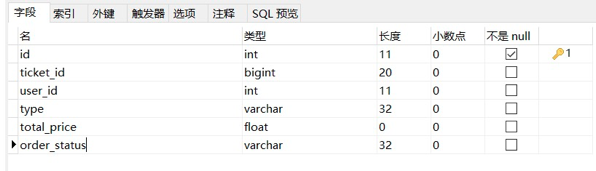
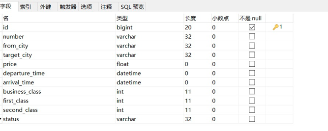
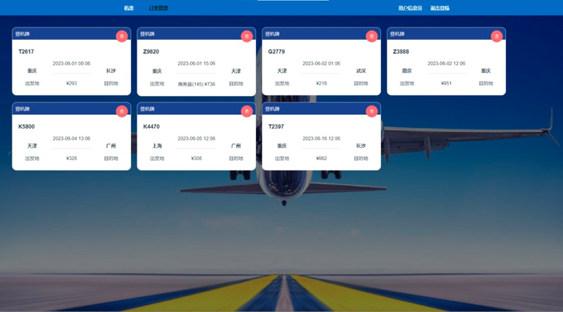
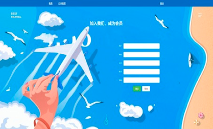

# **机票预定**系统项目介绍

**本项目基于Spring boot + vue开发，使用Spring Security实现登陆和鉴权，MySQL存储数据，redis作为缓存和分布式锁。**

前端代码：https://github.com/ChenZixinn/Aircraft

### 1、开发环境

开发工具：Intellij IDEA，Visual Studio Code

运行环境：JDK8

主要组件： **Redis、SpringBoot、vue、MySQL、Spring Security、Redisson**

### 2、数据表

##### 用户表（user）

##### 机票表 （ticket）

##### 订单表（order_ticket）

### 3、界面展示

##### 机票预订页

##### 

##### 订单管理页

##### **登录注册页**

